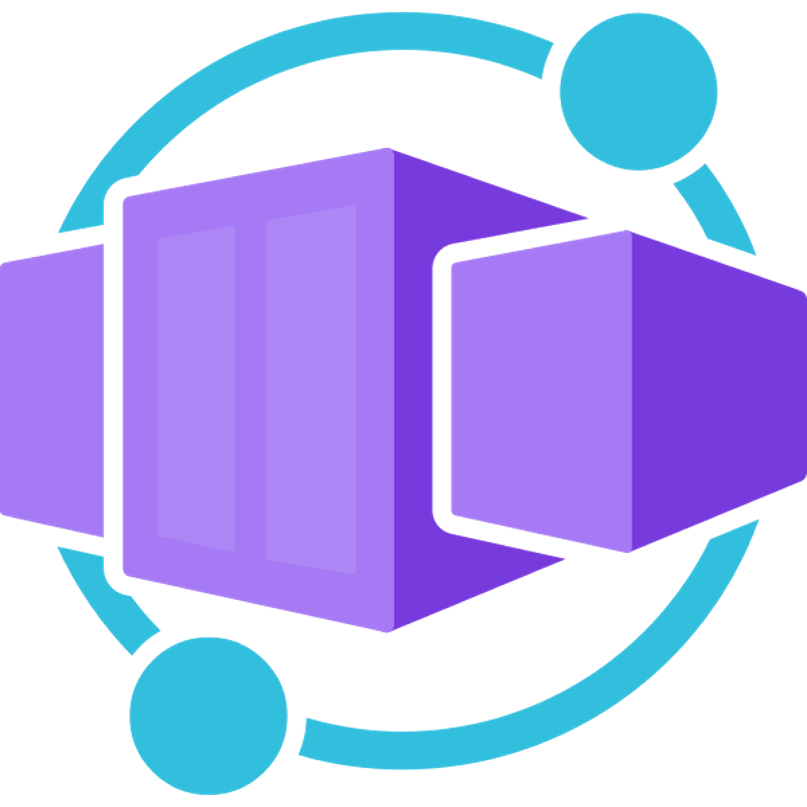
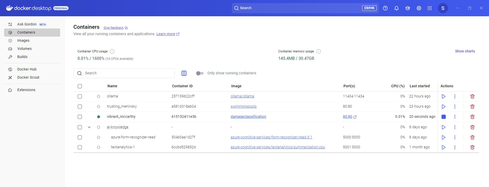

# Azure AI services on containers samples

## What is a container?
A container comprises an application or service and the runtime components needed to run it, while abstracting the underlying operating system and hardware. In practice, this abstraction results in two significant benefits:
- **Containers are portable across hosts**, which may be running different operating systems or use different hardware - making it easier to move an application and all its dependencies.
- A single container host can **support multiple isolated containers**, each with its own specific runtime configuration - making it easier to consolidate multiple applications that have different configuration requirement.

A container is encapsulated in a container image that defines the software and configuration it must support. Images can be stored in a central registry, such as Docker Hub, or you can maintain a set of images in your own registry.

## Container deployment
To use a container, you typically pull the container image from a registry and deploy it to a container host, specifying any required configuration settings. The container host can be in the cloud, in a private network, or on your local computer. For example:

- A Docker* server 
  https://docs.docker.com/
- An Azure Container Instance (ACI) 
  https://learn.microsoft.com/en-us/azure/container-instances/
- An Azure Container Apps (full serverless with scaling to 0) 
  https://learn.microsoft.com/en-us/azure/container-apps/overview
- An Azure Kubernetes Service (AKS) cluster 
  https://learn.microsoft.com/en-us/azure/container-apps/overview
  
*Docker is an open source solution for container development and management that includes a server engine that you can use to host containers. There are versions of the Docker server for common operating systems, including Microsoft Windows and Linux.

### Some docker images
 
### Some docker containers
 

## Azure AI services on containers
- **Azure AI services provide several Docker containers** that let you use the same APIs that are available in **Azure, on-premises**. Using these containers gives you the flexibility to bring Azure AI services closer to your data for compliance, security or other operational reasons. Container support is currently available for a subset of Azure AI services. 
- Azure AI containers allow developers to use the same intelligent APIs that are available in Azure, but with the **benefits of containerization**.
Container services offer similar feature capabilities as the corresponding cloud service. **Customers can deploy the containers on-premise**. The core AI technology, pricing tiers, API keys, and API signature are the same between the container and the corresponding cloud services.

### List of Azure AI services containers
https://learn.microsoft.com/en-us/azure/ai-services/cognitive-services-container-support

## Types of Containers
There are two types of container offerings: 
- **Connected containers:** keeps all the data processing locally but **send the billing data to the cloud so you are charged as you use the service**.
- **Disconnected containers:** enable you to use several of these APIs disconnected from the internet, with the customer making an **upfront payment for a year's worth of consumption** with no data sent to the cloud!

## PowerPoint presentation
<a href="https://github.com/retkowsky/azure-ai-containers-samples/blob/main/Azure%20AI%20services%20Containers.pdf">PowerPoint document</a>

## Documentation
- Azure AI Containers documentation 
https://learn.microsoft.com/en-us/azure/cognitive-services/containers/
- Application for Disconnected Containers 
https://customervoice.microsoft.com/Pages/ResponsePage.aspx?id=v4j5cvGGr0GRqy180BHbR7en2Ais5pxKtso_Pz4b1_xUNDVVMVBPV09ITVBBR0E5T05QQ1VESFlSMCQlQCN0PWcu
- Microsoft containers 
https://mcr.microsoft.com/en-us/ 
https://hub.docker.com/u/microsoft

## FAQ
- FAQ for Azure AI Containers 
https://learn.microsoft.com/en-us/azure/cognitive-services/containers/container-faq
- FAQ for Azure AI Disconnected containers 
https://learn.microsoft.com/en-us/azure/ai-services/containers/disconnected-container-faq

## Demos videos
https://aka.ms/azureai-edge-demosvideos 

## Training
https://learn.microsoft.com/en-us/training/modules/investigate-container-for-use-with-ai-services/

## Accelerator
https://github.com/Azure-Samples/AI-KnowlEDGE

 
Serge Retkowsky | serge.retkowsky@microsoft.com | https://www.linkedin.com/in/serger/
  
Date of creation: 08-April-2025 
Updated: 09-April-2025
