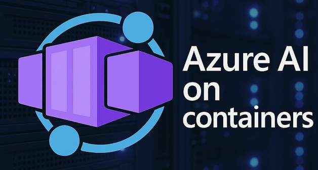
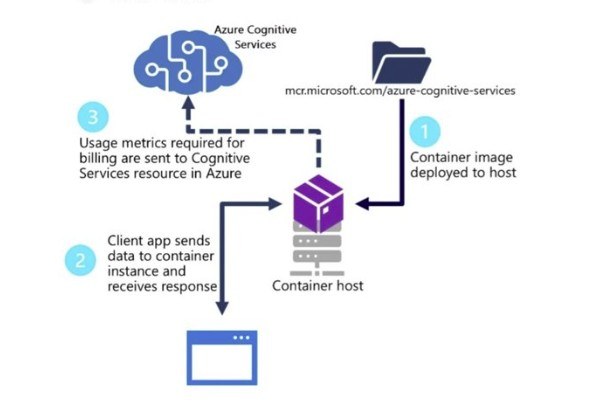
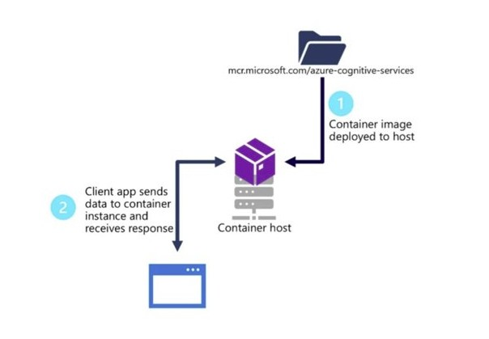
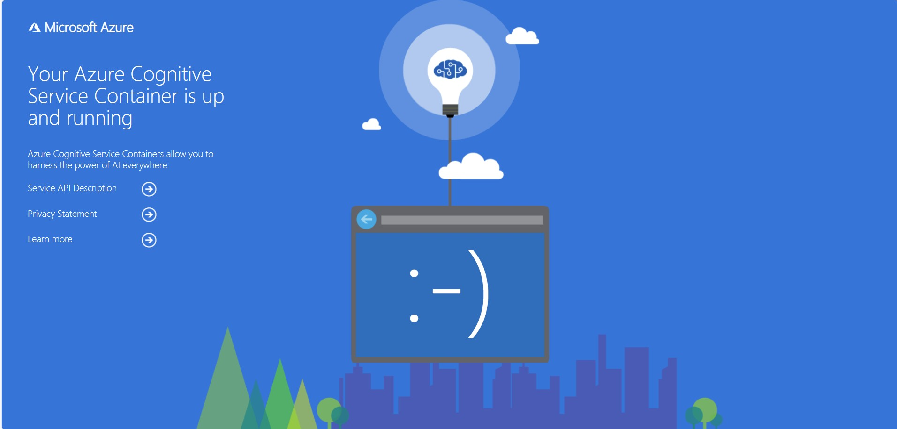

# Azure AI Services on Containers: Professional Samples & Deployment Guide



This repository provides comprehensive samples, documentation, and deployment guidance to help you harness the power of **Azure AI Services Containers**. Leverage on-premises or hybrid-cloud AI with Microsoft’s enterprise-grade containerized AI services for advanced vision, language, and decision intelligence—all while meeting data residency, control, and regulatory demands.

---

## 🧩 Table of Contents

1. [What is a Container?](#what-is-a-container)
2. [Azure AI Containers Overview](#azure-ai-containers-overview)
   - [Advantages](#advantages)
   - [Supported AI Containers](#supported-ai-containers)
   - [Connected vs. Disconnected Containers](#connected-vs-disconnected-containers)
3. [Deployment Scenarios](#deployment-scenarios)
   - [Microsoft Container Registry](#microsoft-container-registry)
   - [Docker Deployment](#docker-deployment)
4. [Step-by-Step Installation](#step-by-step-installation)
5. [Reference Materials](#reference-materials)
6. [FAQ](#faq)
7. [Demos, Training & Accelerators](#demos-training--accelerators)
8. [Contact](#contact)

---

## What is a Container?

A **container** packages an application and its dependencies in one portable unit, abstracting the underlying OS and hardware for true cloud/on-premises portability and agility:
- **Portability:** Deploy across any OS/hardware with consistent results.
- **Isolation:** Run multiple secure, isolated containers on a single host—enabling app consolidation.
- **Efficiency:** Lightweight and fast to deploy.
- **Simplified Management:** Images stored centrally (e.g., Docker Hub, Azure MCR).

---

## Azure AI Containers Overview

Azure AI containers enable you to run Microsoft AI services (Cognitive Services, Applied AI, and more) in **Docker containers** on your infrastructure—cloud, on-premises, or at the edge:

### Advantages

1. **High Throughput and Low Latency:**  
   Ideal for bulk data processing and scenarios with low-latency needs due to local deployment.

2. **Complete Data Control:**  
   All customer data processing remains local for maximum compliance (ideal for healthcare, finance, and regulated industries).

3. **Offline & Edge Scenarios:**  
   Operate in disconnected/low-bandwidth environments or at the edge (e.g. remote sites, ships).

4. **Controlled Deployment & Versioning:**  
   Manage your own update cycle; create/destroy containers as needed for flexible operations.

### Supported AI Containers

For a full list, see the [Azure AI Container Support Matrix](https://learn.microsoft.com/en-us/azure/ai-services/cognitive-services-container-support).

### Connected vs. Disconnected Containers

- **Connected Containers:**  
  Data processing is local, but billing/telemetry is sent to Azure (pay-as-you-go model).  
  

- **Disconnected Containers:**  
  Fully offline (annual prepaid license required, no cloud interaction).  
  

---

## Deployment Scenarios

Deploy Azure AI containers using your preferred orchestration environment:

- **Docker Engine:**  
  https://docs.docker.com/

- **Azure Container Instances (ACI):**  
  https://learn.microsoft.com/en-us/azure/container-instances/

- **Azure Container Apps (serverless, scale-to-zero):**  
  https://learn.microsoft.com/en-us/azure/container-apps/overview

- **Azure Kubernetes Service (AKS):**  
  https://learn.microsoft.com/en-us/azure/container-apps/overview

### Microsoft Container Registry

All official Azure AI service images are hosted on [Microsoft Artifact Registry (MCR)](https://mcr.microsoft.com/en-us/catalog?search=AI&type=partial).

---

## Docker Deployment

**Sample Docker Commands**

1. **Pull the Container**
   ```sh
   docker pull mcr.microsoft.com/azure-cognitive-services/form-recognizer/layout-4.0
   ```

2. **Run the Container**
   ```sh
   docker run --rm -it -p 5000:5000 --memory 18g --cpus 8 \
   mcr.microsoft.com/azure-cognitive-services/form-recognizer/layout-4.0 \
   EULA=accept BILLING=https://<yourendpoint>.cognitiveservices.azure.com <API_KEY>
   ```

3. **Container Status Example**
   

---

## Step-by-Step Installation

1. **Review Prerequisites:**  
   - Docker installed
   - Azure subscription & endpoint (for connected mode)
   - Sufficient memory/CPU per container specs

2. **Select, Pull & Run Your Desired Container:**  
   Choose from [AI services containers](https://learn.microsoft.com/en-us/azure/ai-services/cognitive-services-container-support).

3. **Monitor & Manage:**  
   Use Docker commands and your preferred orchestration tools.

---

## Reference Materials

- [Azure AI Containers Documentation](https://learn.microsoft.com/en-us/azure/cognitive-services/containers/)
- [Disconnected Containers Registration](https://customervoice.microsoft.com/Pages/ResponsePage.aspx?id=v4j5cvGGr0GRqy180BHbR7en2Ais5pxKtso_Pz4b1_xUNDVVMVBPV09ITVBBR0E5T05QQ1VESFlSMCQlQCN0PWcu)
- [Microsoft Container Registry (MCR)](https://mcr.microsoft.com/en-us/)
- [Microsoft on Docker Hub](https://hub.docker.com/u/microsoft)

---

## FAQ

- [Containers FAQ](https://learn.microsoft.com/en-us/azure/cognitive-services/containers/container-faq)
- [Disconnected Containers FAQ](https://learn.microsoft.com/en-us/azure/ai-services/containers/disconnected-container-faq)

---

## Demos, Training & Accelerators

- [Demo videos](https://aka.ms/azureai-edge-demosvideos)
- [Microsoft Learn - AI Containers Module](https://learn.microsoft.com/en-us/training/modules/investigate-container-for-use-with-ai-services/)
- [AI-KnowlEDGE Accelerator](https://github.com/Azure-Samples/AI-KnowlEDGE)
- [PowerPoint: Azure AI Services Containers Overview](https://github.com/retkowsky/azure-ai-containers-samples/blob/main/Azure%20AI%20services%20Containers.pdf)

---

## Contact

Serge Retkowsky  
📧 serge.retkowsky@microsoft.com  
[LinkedIn](https://www.linkedin.com/in/serger/)

_Original: 08-April-2025_  
_Updated: 10-April-2025_